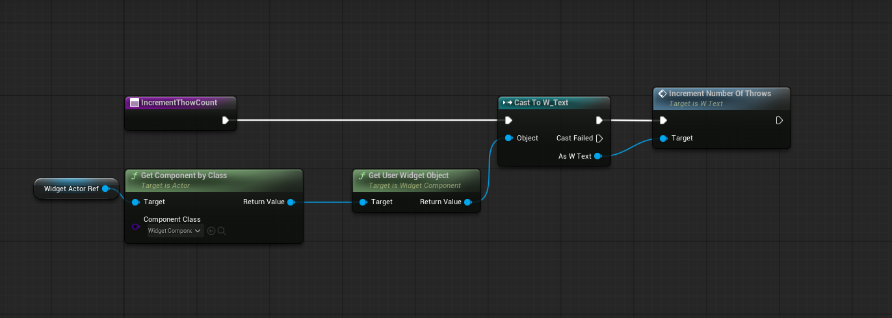

I started with creating structure spawner. I spend some time to create a robust algorithm for number of elements in StructureSpawner, for example if you give a number of elements parameter which is not in the set 1,3,6,10,15,... it can create the correct tower solving an inequality regarding the pyramid.

Afterwards I continued with throwable spawner. I had hard times establishng a custom Input Mapping Context, it took so much time to find the solution. We have already talked about this in the forum. The issue was the input mapping was not working. And I solved it adding my custom mapping to the project settings under enhanced input.

After that, I implemented UI with User Widgets. It was not trivial but was not that hard in comparison to other tasks.

For me, the input mapping context issue was the most challending part. Because I spend hours on it, and the solution was trivial.

Spawner BP:

Row creating in spawner:

UI:

Call to update UI in throwableSpawner:
